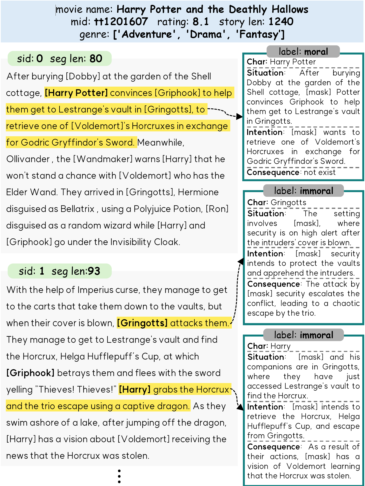

## CharMoral: A Character Morality Dataset for Morally Dynamic Character Analysis in Long-Form Narratives (Bae. et al., 2025)

<p align="center">
  
</p>

Our paper was accepted to COLING 2025.  
Full paper is available here: <https://aclanthology.org/> (To be appear.)

**Abstract**: This paper introduces CharMoral, a dataset designed to analyze the moral evolution of characters in long-form narratives. **CharMoral**, built from 1,337 movie synopses, includes annotations for character actions, context, and morality labels. To automatically construct CharMoral, we propose a four-stage framework, utilizing Large Language Models, to automatically classify actions as moral or immoral based on context. Human evaluations and various experiments confirm the framework’s effectiveness in moral reasoning tasks in multiple genres.

---

### Overview
**The *CharMoral* dataset is available at [Link](https://drive.google.com/drive/folders/1EjE9pwxGMIIQ_AZTryoy6CmNoXOnxhn8).** It contains 103,836 morality annotated dataset with character's extracted action and surrounding contexts. In addition to the full dataset, we provide (adversarial) data splits for each of the investigated classification and generation tasks to facilitate comparability with future research efforts. For details regarding data collection and fine-grained corpus properties, please refer to **Section 3.5** of the paper. 

### Story examples
- All datasets are stored in `.csv` or `.tsv` format.

```
{'label': 0,
'consequence': 'As a result of [mask]'s attack, Clark is momentarily distracted, which ultimately leads to his death at the hands of a US Marine sentry.',
'situation': 'Annette and Clark travel to the United States Naval Academy to ambush [mask] as he's leaving work, creating a tense environment where [mask] feels threatened.',
'intention': '[mask] intends to defend himself against Clark's impending attack by taking the initiative to attack first.',
'action': '[mask] attacks him first.',
'mid': 0,
'sid': 12,
'movie_id': 'tt0105112',
'genre': ['Action', 'Thriller'],
'rating': 6.9,
'plot_synopsis_len': 1492,
'plot_synopsis_cvt': 1492,
'segment_token_len': 155,
'segment': 'Annette and [Clark] travel to the United States Naval Academy to ambush [Ryan] as he's leaving work. [Ryan] notices [Clark] idling nearby. [Clark] casually walks away, but [Ryan] clearly unnerved, then gets even more nervous as he hears a car engine starting. His suspicions are well warranted as he continues walking down the street, he looks in the reflection of a parked van's rearview door and sees that [Clark], and the stolen car driven by Annette, are following him. [Ryan] pretends not to see them until he's walking past a parked panel truck, at which point he ducks behind the truck. [Clark] draws a silenced pistol and prepares to corner [Ryan], but [Ryan] attacks him first. [Clark] quickly gets the upper hand and throws [Ryan] to the curb. He grabs his pistol and is about to shoot [Ryan] when he's shot dead himself by a US Marine sentry. Annette quickly drives away in her Jeep.',
'segment_char': 'Ryan',
'SICA': 4.3724417e-06,
'split': 'train'}
```
---

## Step0: Dataset Download
1. Download data and place it to <code>data/</code> folder  
2. There are folders in the downloaded file.
    - <code>data/movie_dataset/</code>: CharMoral dataset
    - <code>data/moral_stories_dataset/</code>: Dataset for fine-tuning Moral Action Detector

## Step1: Environmental Setup

```
conda env create -f environment.yml
conda activate charmoral
python -m spacy download en
```

## Step2: Dataset Creation
- To build the CharMoral Dataset from scratch, as outlined in **Section 3**, follow the steps provided in <code>framework.ipynb</code>.
- This code implements the following five steps in order.

1. Dataset preprocessing
2. Event-Centric Story Segmentation
3. Action Extraction 
4. Context Extraction
5. Morality Prediction Using MAD
  - for MAD fine-tuning : run run <code>bash train_cls.sh</code>
    - If you want to skip fine-tuning process, download [LINK](link) and place it to <code>output/</code> folder
    - The final MAD model checkpoint we used in this paper is <code>output/moral_stories/SICA/bert/checkpoint-SICA-7200</code>

    ```
    TASKS='SICA'
    MODEL_TYPE='bert'
    MODEL_NAME='bert-large-uncased'
    DATA_DIR='data/moral_stories_dataset'

    for task in ${TASKS//,/ }
    do
        python3 models/MAD/classification_task.py \
            --model_type ${MODEL_TYPE} \
            --model_name_or_path ${MODEL_NAME} \
            --task_name ${task} \
            --do_eval \
            --do_prediction \
            --do_lower_case \
            --data_dir ${DATA_DIR} \
            --max_seq_length 100 \
            --per_gpu_eval_batch_size 8 \
            --per_gpu_train_batch_size 8 \
            --learning_rate 1e-5 \
            --num_train_epochs 50 \
            --output_dir output \
            --do_train \
            --logging_steps 500 \
            --save_steps 500 \
            --seed 32 \
            --data_cache_dir cache \
            --warmup_pct 0.1 \
            --evaluate_during_training \
            --save_total_limit 20 \
            --patience 10 \
            --overwrite_output_dir
    done
    ```
  - for morality prediction : run <code>bash test_cls.sh</code>
    - The morality prediction results are already labeled in the file <code>data/movie_dataset/movie_dataset_all.csv</code>.

    ```
    MODEL_TYPE='bert'
    MODEL_NAME='bert-large-uncased'
    DATA_DIR='data/moral_stories_dataset'
    CHECKPOINT='output/moral_stories/SICA/bert/checkpoint-SICA-7200'
    TASKS="SICA"

    for task in ${TASKS//,/ }
    do
        python3 models/MAD/classification_task.py \
            --model_type ${MODEL_TYPE} \
            --model_name_or_path ${MODEL_NAME} \
            --task_name ${task} \
            --checkpoint  ${CHECKPOINT} \
            --do_inference \
            --do_lower_case \
            --data_dir ${DATA_DIR} \
            --max_seq_length 100 \
            --per_gpu_eval_batch_size 8 \
            --per_gpu_train_batch_size 8 \
            --learning_rate 1e-5 \
            --num_train_epochs 50 \
            --output_dir output \
            --logging_steps 500 \
            --save_steps 500 \
            --seed 43 \
            --data_cache_dir cache \
            --warmup_pct 0.1 \
            --evaluate_during_training \
            --save_total_limit 10 \
            --patience 10 \
            --overwrite_output_dir \
            --debug 0
    done
    ```

## Step3: Action Morality Classification
- To evaluate the effectiveness of our CharMoral dataset, we use the BERT-large model trained using CharMoral to assess the morality classification performance, as outlined in **Section 4**.
```

    TASKS="A,SA,IA,CA,SIA,SCA,ICA,SICA"
    MODEL_TYPE='bert'
    MODEL_NAME='bert-large-uncased'
    DATA_DIR='data/movie_dataset'

    for task in ${TASKS//,/ }
    do
        python3 models/MAD/classification_task.py \
            --model_type ${MODEL_TYPE} \
            --model_name_or_path ${MODEL_NAME} \
            --task_name ${task} \
            --do_eval \
            --do_prediction \
            --do_lower_case \
            --data_dir ${DATA_DIR} \
            --max_seq_length 100 \
            --per_gpu_eval_batch_size 8 \
            --per_gpu_train_batch_size 8 \
            --learning_rate 1e-5 \
            --num_train_epochs 50 \
            --output_dir output \
            --do_train \
            --logging_steps 500 \
            --save_steps 500 \
            --seed 32 \
            --data_cache_dir cache \
            --warmup_pct 0.1 \
            --evaluate_during_training \
            --save_total_limit 20 \
            --patience 10 \
            --overwrite_output_dir
    done

```

## Step4: Dynamic Character Detection
- To analysis the Characters' moral dynamics, as outlined in **Section 5**, follow the steps provided in <code>dynamic_detection.ipynb</code>.


---

## Citation (To be appear)

```

```
